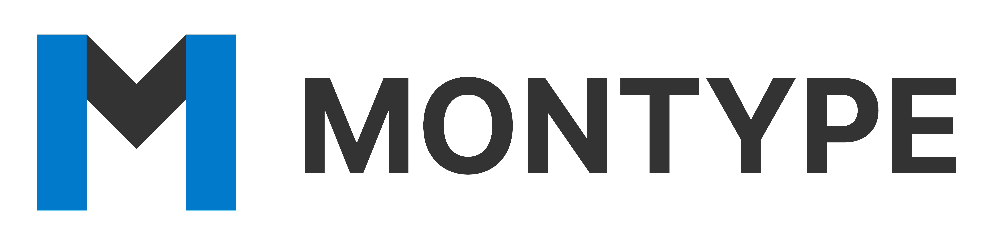

<p align="center">
  
</p>
  
## Purpose
MonType converts your [mongoose](https://github.com/Automattic/mongoose) schemas into TypeScript interfaces so you don't have to.
  
## Usage
Define your schema, like you always do; example from [mongoosejs.com](https://mongoosejs.com/docs/schematypes.html)
```typescript
const schema = new Schema({
  name:    String,
  binary:  Buffer,
  living:  Boolean,
  updated: { type: Date, default: Date.now },
  age:     { type: Number, min: 18, max: 65 },
  mixed:   Schema.Types.Mixed,
  _someId: Schema.Types.ObjectId,
  decimal: Schema.Types.Decimal128,
  array: [],
  ofString: [String],
  ofNumber: [Number],
  ofDates: [Date],
  ofBuffer: [Buffer],
  ofBoolean: [Boolean],
  ofMixed: [Schema.Types.Mixed],
  ofObjectId: [Schema.Types.ObjectId],
  ofArrays: [[]],
  ofArrayOfNumbers: [[Number]],
  nested: {
    stuff: { type: String, lowercase: true, trim: true }
  },
  map: Map,
  mapOfString: {
    type: Map,
    of: String
  }
});
```

Run `montype --from schema.ts`, and MonType will convert it into a TypeScript interface:
```typescript
import mongoose from 'mongoose';

interface schema {
  name: string;
  binary: mongoose.Schema.Types.Buffer;
  living: boolean;
  updated: Date;
  age: number;
  mixed: mongoose.Schema.Types.Mixed;
  _someId: mongoose.Schema.Types.ObjectId;
  decimal: mongoose.Schema.Types.Decimal128;
  array: never[];
  ofString: string[];
  ofNumber: number[];
  ofDates: Date[];
  ofBuffer: mongoose.Schema.Types.Buffer[];
  ofBoolean: boolean[];
  ofMixed: mongoose.Schema.Types.Mixed[];
  ofObjectId: mongoose.Schema.Types.ObjectId[];
  ofArrays: never[][];
  ofArrayOfNumbers: number[][];
  nested: {
    stuff: string;
  };
  map: mongoose.Schema.Types.Map;
  mapOfString: Map<string, String>;
};
```
  
Just like that!
  
## How it works
MonType parses the source file, and generates an AST from it. It then generates a TypeScript interface from the AST. What this means is that MonType only sees your schemas as a structured chunk of text -- nothing less, nothing more.
  
It's completely independent from your source, does not add additional dependencies to your project, and is highly portable and capable on working on any file that looks like a Mongoose schema.

## Installation
You can install MonType by either:
* Downloading a precompiled binary from the [releases](https://github.com/uditkarode/montype/releases) page
* Downloading a build artifact from a Github Actions [run](https://github.com/uditkarode/montype/actions)
* Compiling it yourself using [build.sh](https://github.com/uditkarode/montype/blob/master/build.sh)
  
## Configuration
MonType works by 'mapping' descriptors to their TypeScript types, for example `String` -> `string`, `Number` -> `number`, and so on.
  
This means that if you use a custom type in your Schema, MonType will fail:
```diff
- [×| Category.ts
-   | couldn't map the schema type 'MyType' to a TypeScript type!
```
  
To get around this, you can create a configuration file called `montype.ini` (or use the `-c` flag to provide a path) with the contents:
```ini
[types]
MyType = number
```
  
MonType will now interpret `MyType` as `number`, and succeed.
```diff
+ [✓] saved to 'MonType.ts'
```

Please read `montype --help` for more information!
  
## Credits
Thanks to [@MKRhere](https://github.com/MKRhere) for listening to and answering my barrage of questions!
